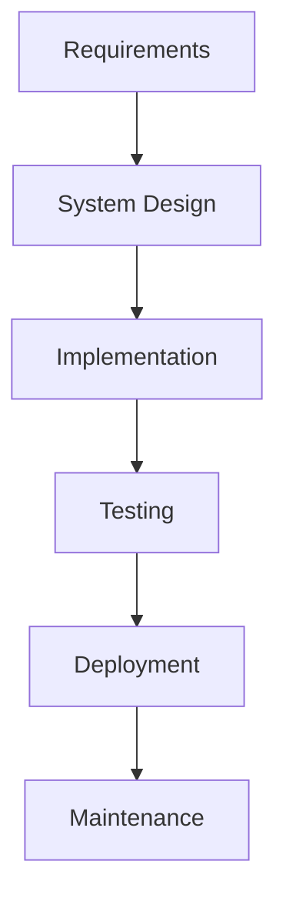

# Chương 1. Giới thiệu về công nghệ phần mềm

1.7 Bài tập và câu hỏi

Bài 1. Bạn sẽ lựa chọn theo Công nghệ phần mềm hay Khoa học máy tính? Tại sao?

Câu hỏi 1.1 Dưới đây là các giai đoạn phát triển phần mềm. Phát biểu nào không đúng?

A. Lấy và phân tích yêu cầu; Thiết kế

B. Lập trình; Kiểm thử

<mark>C. Họp nhóm dự án</mark>

D. Triển khai; Vận hành và Bảo trì

Câu hỏi 1.2 Một số thách thức của các dự án CNPM. Phát biểu nào không đúng?

A. Vượt quá ngân sách

B. Trễ tiến độ

C. Chất lượng kém

<mark>D. Dễ bảo trì</mark>

Câu hỏi 1.3 Một phần mềm như thế nào là có chất lượng? Phát biểu nào không đúng?

A. Tính hiệu quả (efficiency)

<mark>B. Tính khó bảo trì (non maintainability)</mark>

C. Tính bảo mật và tin cậy (security & reliability)

D. Tính dễ sử dụng (usability)

