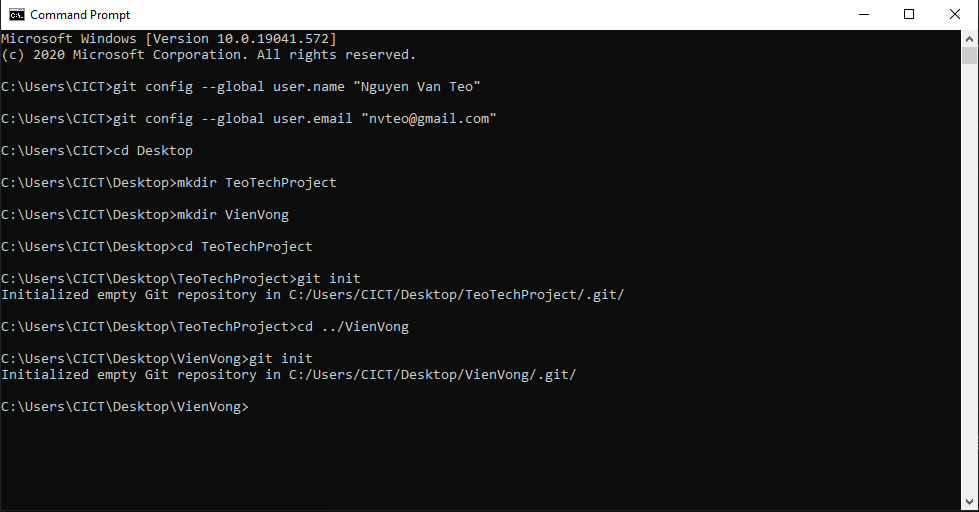
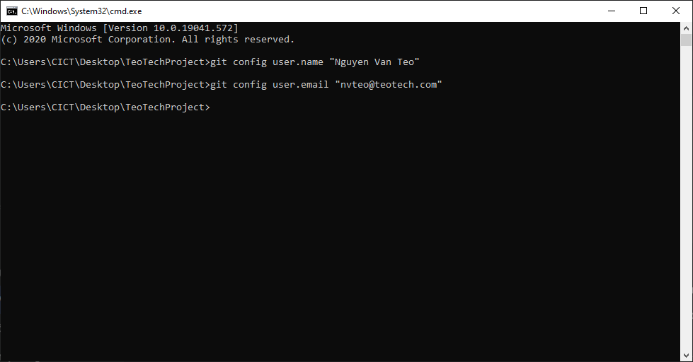
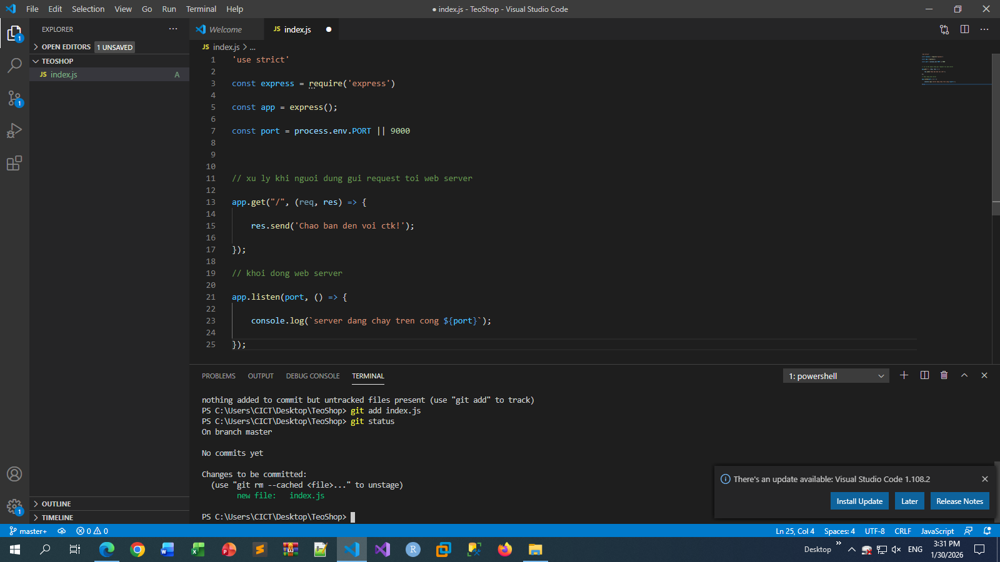
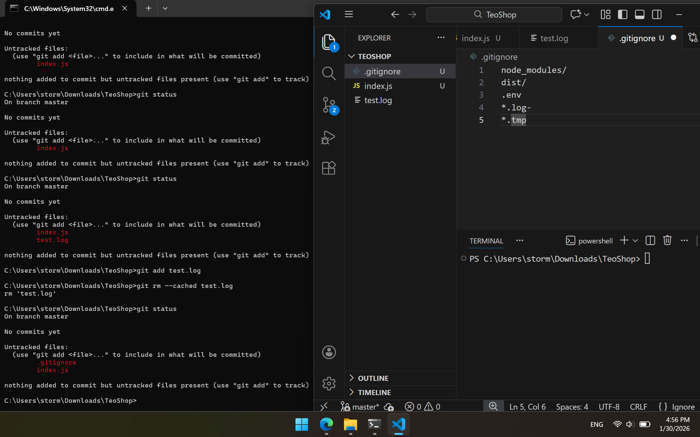
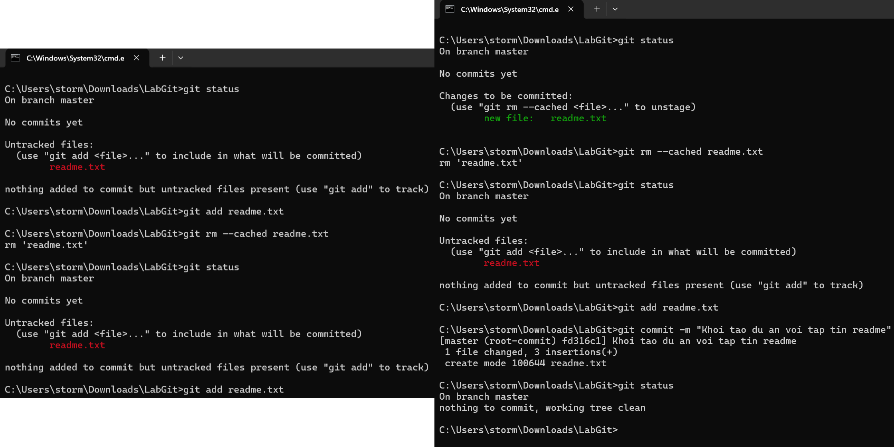
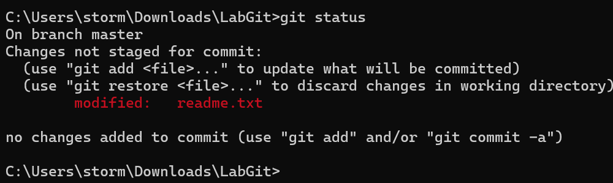

# Chương 1. Giới thiệu về công nghệ phần mềm

## 1.7. Bài tập và câu hỏi

<b>Bài 1. Bạn sẽ lựa chọn theo Công nghệ phần mềm hay Khoa học máy tính? Tại sao?</b>

Tôi lựa chọn theo **Công nghệ phần mềm**. Vì tôi thích việc tạo ra các sản phẩm ứng dụng thực tế để giải quyết vấn đề cho người dùng. Tôi quan tâm đến quy trình làm ra phần mềm, từ lúc lấy yêu cầu, thiết kế hệ thống cho đến khi kiểm thử và bảo trì, cũng như cách làm việc nhóm hiệu quả trong dự án.

<b>Câu 1.1 Dưới đây là các giai đoạn phát triển phần mềm. Phát biểu nào không đúng?</b> <br>
A. Lấy và phân tích yêu cầu; Thiết kế <br>
B. Lập trình; Kiểm thử <br>
<mark>C. Họp nhóm dự án</mark> <br>
D. Triển khai; Vận hành và Bảo trì

> *Giải thích: "Họp nhóm" là một hoạt động giao tiếp diễn ra thường xuyên trong suốt quá trình làm việc, nó không phải là tên một giai đoạn kỹ thuật chính thức (Phase) trong vòng đời phát triển phần mềm (SDLC).*

<b>Câu 1.2 Một số thách thức của các dự án CNPM. Phát biểu nào không đúng?</b> <br>
A. Vượt quá ngân sách <br>
B. Trễ tiến độ <br>
C. Chất lượng kém <br>
<mark>D. Dễ bảo trì</mark>

> *Giải thích: "Dễ bảo trì" là mục tiêu tốt đẹp mà phần mềm hướng tới. Thách thức (khó khăn) của dự án phải là "Khó bảo trì" hoặc "Chi phí bảo trì tốn kém".*

<b>Câu 1.3 Một phần mềm như thế nào là có chất lượng? Phát biểu nào không đúng?</b> <br>
A. Tính hiệu quả (efficiency) <br>
<mark>B. Tính khó bảo trì (non maintainability)</mark> <br>
C. Tính bảo mật và tin cậy (security & reliability) <br>
D. Tính dễ sử dụng (usability)

> *Giải thích: Phần mềm chất lượng phải CÓ tính bảo trì (Maintainability). Tính "khó bảo trì" là đặc điểm của phần mềm kém chất lượng (Legacy code, Spaghetti code).*

# Chương 2. Các mô hình phát triển phần mềm

## 2.5. Bài tập và câu hỏi

### Bài 2a. Vẽ lại sơ đồ các mô hình

**1. Mô hình Thác nước (Waterfall Model)**

<pre class="mermaid">
graph TD
    A[Requirements] --> B[System Design]
    B --> C[Implementation]
    C --> D[Integration & Testing]
    D --> E[Deployment of System]
    E --> F[Maintenance]
</pre>

**2. Mô hình Chữ V (V-Model)**

<pre class="mermaid">
graph TD
    subgraph Development Phase
    A[Requirements Analysis] --> B[System Design]
    B --> C[Architecture Design]
    C --> D[Module Design]
    end
    
    D --> E[Coding]
    
    subgraph Testing Phase
    E --> F[Unit Testing]
    F --> G[Integration Testing]
    G --> H[System Testing]
    H --> I[Acceptance Testing]
    end

    %% Các đường liên kết ngang thể hiện sự tương ứng (Validation)
    A -.-> I
    B -.-> H
    C -.-> G
    D -.-> F
</pre>

**3. Mô hình Tăng trưởng lặp (Iterative Model)**

<pre class="mermaid">
graph LR
    A((Start)) --> B[Initial Planning]
    B --> C{Iteration Cycle}
    C --> D[Planning]
    D --> E[Requirements]
    E --> F[Analysis & Design]
    F --> G[Implementation]
    G --> H[Testing]
    H --> I[Evaluation]
    I --> C
    I --> J((End/Deploy))
</pre>

**4. Mô hình Agile / Scrum**

<pre class="mermaid">
graph LR
    %% --- GIAI ĐOẠN CHUẨN BỊ ---
    Start1[Scope] --> Start2[Product Backlog]
    Start2 --> Start3[Design]

    %% --- VÒNG LẶP SCRUM ---
    subgraph ScrumCycle ["SCRUM METHODOLOGY"]
        direction TB
        P1(Sprint Planning meeting) --> P2[Sprint Backlog]
        P2 --> P3[Sprint Execution]
        
        %% Daily Scrum loop
        P3 -- Daily Loop --> P4((Daily Scrum))
        P4 --> P3
        
        P3 --> P5[Sprint Automation]
        P5 --> P6[Sprint Review Meeting]
        P6 --> P7[Sprint Retrospective]
        
        P7 -.-> P1
    end

    %% --- KẾT NỐI RA ---
    Start3 --> P1
    P6 --> EndNode[Usable Software]
</pre>

### Bài 2b. Mô tả công việc và công cụ mô hình Thác nước

| Giai đoạn | Mô tả công việc | Công cụ thường dùng |
| :--- | :--- | :--- |
| **Requirements** | Thu thập và phân tích yêu cầu từ khách hàng. | Word, Google Docs, Jira |
| **System Design** | Thiết kế kiến trúc, CSDL, giao diện. | Visio, Draw.io, Figma |
| **Implementation** | Viết mã nguồn (coding). | VS Code, IntelliJ, Git |
| **Testing** | Kiểm thử tìm lỗi (bugs). | Selenium, JUnit, TestRail |
| **Deployment** | Cài đặt lên môi trường thực tế. | Docker, Jenkins, AWS |
| **Maintenance** | Bảo trì, sửa lỗi, nâng cấp. | Jira Service Desk |

<b>Câu 2.1 Về mô hình Thác nước. Phát biểu nào không đúng?</b> <br>
A. Mỗi giai đoạn phải được hoàn thành trước khi chuyển sang giai đoạn tiếp theo. <br>
<mark>B. Không phù hợp với các dự án có yêu cầu ổn định, đã được xác định rõ ràng ngay từ đầu.</mark> <br>
C. Đây là mô hình tuần tự, tuyến tính như dòng thác. <br>
D. Phù hợp với các dự án có yêu cầu ổn định.

> *Giải thích: Đáp án B sai vì mô hình Thác nước cực kỳ phù hợp với dự án ổn định, ít thay đổi.*

<b>Câu 2.2 Trong mô hình chữ V có đề cập tới 4 loại kiểm thử. Loại kiểm thử nào sau đây không đúng tên gọi?</b> <br>
A. Acceptance Testing <br>
<mark>B. Coding Testing</mark> <br>
C. System Testing <br>
D. Integration Testing

> *Giải thích: Trong V-Model, mức kiểm thử thấp nhất (tương ứng với Module Design) được gọi là **Unit Testing** (Kiểm thử đơn vị), không ai gọi là "Coding Testing".*

<b>Câu 2.3 Mô hình tiếp cận lặp gồm các công đoạn sau. Phát biểu nào không đúng?</b> <br>
A. Requirements <br>
<mark>B. Integration</mark> <br>
C. Design & Development <br>
D. Testing

> *Giải thích: Thông thường các pha chính là Requirements -> Design -> Dev -> Test. "Integration" thường là một hành động nằm trong pha Dev hoặc Test, ít khi đứng tên là một giai đoạn lớn ngang hàng với Requirements.*

<b>Câu 2.4 Trong mô hình Agile/Scrum. Phát biểu nào sau đây không đúng?</b> <br>
<mark>A. Scope: xác định phạm vi của biến</mark> <br>
B. Sprint: một chu kỳ phát triển ngắn (1-4 tuần). <br>
C. Product backlog: danh mục các chức năng của sản phẩm. <br>
D. Sprint backlog: danh mục chức năng của một sprint.

> *Giải thích: "Scope" trong quản lý dự án nghĩa là **Phạm vi dự án** (những việc cần làm, giới hạn công việc), hoàn toàn khác với khái niệm "phạm vi của biến" (variable scope) trong lập trình code.*

# Chương 3. Hệ thống quản lý phiên bản

## 1.6. Bài tập

<b>Câu 1.1 Các đặc điểm của hệ thống quản lý phiên bản cục bộ (Local VCS). Phát biểu nào không đúng?</b> <br>
A. Có thể thực hiện thủ công. <br>
B. Không hỗ trợ trong môi trường cộng tác nhiều người. <br>
C. Có thể dùng phần mềm để quản lý phiên bản kiểu cục bộ. <br>
<mark>D. Các phiên bản của dự án được lưu tập trung trên một máy server.</mark>

> *Giải thích: Hệ thống cục bộ chỉ lưu trên ổ cứng máy tính cá nhân. Việc lưu tập trung trên Server là đặc điểm của hệ thống Tập trung (Centralized VCS) hoặc Phân tán (Distributed VCS).*

<b>Câu 1.2 Các đặc điểm của hệ thống quản lý phiên bản tập trung (Centralized VCS). Phát biểu nào không đúng?</b> <br>
A. Các phiên bản của dự án được lưu tập trung trên máy server. <br>
<mark>B. Các máy client sẽ chứa tất cả các phiên bản của thư mục dự án cùng với lịch sử thay đổi.</mark> <br>
C. Máy client không thể tải phiên bản về khi server chết. <br>
D. Hỗ trợ làm việc cộng tác nhiều người.

> *Giải thích: Trong hệ thống tập trung (như SVN), Client thường chỉ tải về bản mới nhất (Snapshot) để làm việc. Việc Client chứa "tất cả lịch sử" là đặc điểm cốt lõi của hệ thống **Phân tán (Distributed)**.*

<b>Câu 1.3 Các đặc điểm của hệ thống quản lý phiên bản phân tán (Distributed VCS). Phát biểu nào không đúng?</b> <br>
A. Các máy client sẽ chứa toàn bộ các phiên bản của dự án, cùng lịch sử thay đổi. <br>
B. Hỗ trợ làm việc cộng tác nhiều người. <br>
C. Các phiên bản của dự án được lưu trên máy server (remote). <br>
<mark>D. Bạn không thể tạo và lưu phiên bản khi không có kết nối mạng tới máy server.</mark>

> *Giải thích: Đây là sức mạnh lớn nhất của hệ thống phân tán (như Git). Bạn hoàn toàn có thể commit (lưu phiên bản) ngay trên máy mình (Local Repo) mà không cần mạng Internet. Khi nào có mạng mới cần đẩy (push) lên server.*

<b>Câu 1.4 Tìm trang chủ của các phần mềm quản lý phiên bản.</b>

| Tên phần mềm | Trang chủ (Website) |
| :--- | :--- |
| **RCS** | [https://www.gnu.org/software/rcs/](https://www.gnu.org/software/rcs/) |
| **CVS** | [http://cvs.nongnu.org/](http://cvs.nongnu.org/) |
| **Subversion (SVN)** | [https://subversion.apache.org/](https://subversion.apache.org/) |
| **Git** | [https://git-scm.com/](https://git-scm.com/) |
| **Mercurial** | [https://www.mercurial-scm.org/](https://www.mercurial-scm.org/) |
| **Darcs** | [http://darcs.net/](http://darcs.net/) |

# Chương 4. Tổng quan về Git

## 2.4. Bài tập

[](Image/5.1.PNG)

[](Image/5.2.PNG)

<b>Bài tập 2.1 Thực hành các cài đặt trong bài học.</b>
*Link tài liệu thực hành: [Click on me](https://drive.google.com/drive/folders/1g5N6bjw-Icr8atUKebA-df_4SeyS7HCV)* <br> (The reason I created more files, folders instead of placing them in here (github) is, the main folder holds everything such as Image, readme, _config file, also include this, index.html which writes down everything here, has .git (Rule: Only 1 .git file is allowed))

<b>Câu 2.2 Lệnh nào được sử dụng để nhúng Git vào thư mục dự án?</b> <br>
<mark>A. git init</mark> <br>
B. git --init <br>
C. git initialize <br>
D. git embed

> *Giải thích: `init` là viết tắt của **initialize** (khởi tạo). Lệnh này sẽ sinh ra một thư mục ẩn tên là `.git` trong dự án. Nếu không có thư mục này, Git sẽ không thể theo dõi dự án.*

<b>Câu 2.3 Lệnh nào sử dụng để kiểm tra trên máy tính đã có phần mềm Git hay chưa?</b> <br>
A. git ver <br>
B. git version <br>
<mark>C. git -v</mark> <br>
D. git --ver

> *Giải thích: Cú pháp chuẩn để kiểm tra phiên bản là `git --version` (đầy đủ) hoặc `git -v` (viết tắt). Các lệnh còn lại không đúng chuẩn cú pháp lệnh của Git.*

<b>Câu 2.4 Trong Git, kho lưu trữ (repo, repository) là gì?</b> <br>
A. Là thư mục dự án. <br>
B. Là thư mục dự án đã được nhúng Git. <br>
C. Là thư mục cài đặt phần mềm Git. <br>
<mark>D. Là thư mục .git (trong thư mục dự án).</mark>

> *Giải thích: Đây là điểm quan trọng nhất. Thư mục bạn nhìn thấy code chỉ là "Thư mục làm việc" (Working Directory). Còn **Kho lưu trữ (Repository)** thực sự chính là thư mục ẩn **`.git`** - nơi chứa toàn bộ cơ sở dữ liệu và lịch sử thay đổi của dự án.*

# Chương 5. Cấu hình định danh người dùng

## 3.4. Bài tập và câu hỏi

<b>Bài tập 3.1: Bài tập tình huống “Quản lý cấu hình Git cho nhiều dự án”</b>

> **Yêu cầu:** Cấu hình để dự án công ty (TeoTech) dùng email công ty, dự án cá nhân (VienVong) dùng email cá nhân.

**Giải pháp thực hiện:**

1.  **Cấu hình chung (Global) cho tài khoản cá nhân:**
    ```bash
    git config --global user.name "Nguyen Van Teo"
    git config --global user.email "nvteo@gmail.com"
    ```
    *(Dùng cho mọi dự án mặc định).*

2.  **Cấu hình riêng (Local) cho dự án công ty:**
    * Di chuyển vào thư mục dự án công ty: `cd TeoTechProject`
    * Chạy lệnh config (không có --global):
    ```bash
    git config user.name "Nguyen Van Teo"
    git config user.email "nvteo@teotech.com"
    ```

**Kết quả:**
* Dự án `VienVongProject`: Dùng email gmail (do lấy từ Global).
* Dự án `TeoTechProject`: Dùng email teotech (do Local ghi đè Global).

<b>Câu 3.2 Phạm vi cấu hình định danh trong Git là gì? Phát biểu nào sau đây không đúng?</b> <br>
A. Phạm vi system áp dụng cho tất cả người dùng và kho lưu trữ trên hệ thống. <br>
B. Phạm vi global áp dụng cho tài khoản người dùng hiện tại và tất cả kho lưu trữ. <br>
<mark>C. Phạm vi local áp dụng cho một kho lưu trữ cụ thể và có độ ưu tiên thấp nhất.</mark> <br>
D. Phạm vi local áp dụng cho một kho lưu trữ cụ thể và có độ ưu tiên cao nhất.

> *Giải thích: Trong Git, cấu hình **Local (Cục bộ)** luôn có độ ưu tiên **CAO NHẤT**. Thứ tự ưu tiên đúng là: Local > Global > System.*

# Chương 6. Các khu vực làm việc của Git

## 4.3. Bài tập và câu hỏi ôn tập

<b>Bài tập 4.1 Thực hành lại các lệnh, tạo các thư mục, tập tin như trong bài học.</b>

[](Image/6.1.PNG)

*Link tài liệu thực hành: [Click on me](https://drive.google.com/drive/folders/1g5N6bjw-Icr8atUKebA-df_4SeyS7HCV)*

<b>Câu 4.2 Ba khu vực làm việc chính của Git là gì? Phát biểu nào sau đây không đúng?</b> <br>
A. Thư mục làm việc (working directory) là nơi bạn chỉnh sửa tập tin trực tiếp. <br>
<mark>B. Khu tạm (staging area) là nơi lưu trữ lịch sử phiên bản của dự án.</mark> <br>
C. Kho chứa (repository) là nơi lưu trữ lịch sử phiên bản của dự án. <br>
D. Lệnh git add được sử dụng để chuyển các thay đổi từ Thư mục làm việc sang Khu tạm.

> *Giải thích: Khu tạm (Staging Area) chỉ là nơi trung gian để chuẩn bị file trước khi commit. Nơi lưu trữ lịch sử thực sự là **Kho chứa (Repository)**.*

<b>Câu 4.3 Thư mục làm việc (working directory) trong Git là gì? Phát biểu nào sau đây không đúng?</b> <br>
A. Là thư mục thực tế trên máy tính, nơi bạn làm việc trực tiếp với các tập tin của dự án. <br>
B. Là nơi bạn tạo, sửa, hoặc xóa tập tin trước khi đưa thay đổi vào .git. <br>
<mark>C. Là nơi lưu trữ lịch sử phiên bản và dữ liệu chính thức của dự án.</mark> <br>
D. Phản ánh các thay đổi so với commit cuối cùng, giúp bạn quyết định những gì cần thêm vào Khu tạm (staging area).

> *Giải thích: Nơi lưu trữ lịch sử và dữ liệu chính thức là thư mục ẩn **.git (Repository)**. Còn Thư mục làm việc chỉ là "bàn làm việc" chứa các file hiện hành để bạn thao tác, sửa đổi.*

# Chương 7. Quản lý dự án phần mềm

## 3.9. Bài tập và câu hỏi

## Bài tập 3a. Mô tả vòng đời dự án cá nhân

**Tên dự án:** Xây dựng Website Portfolio Cá nhân (Giới thiệu bản thân)
**Người thực hiện:** [Điền Họ và Tên của bạn vào đây]

### 1. Giai đoạn Xác định nhiệm vụ (Defining)
* **Mục tiêu (Goal):** Xây dựng một website cá nhân hoàn chỉnh để giới thiệu kỹ năng lập trình, các dự án đã làm và CV online nhằm mục đích xin thực tập/việc làm.
* **Kết quả cần đạt:**
    * Website hoạt động ổn định trên môi trường Internet.
    * Giao diện đẹp, chuyên nghiệp, hiển thị tốt trên cả máy tính và điện thoại (Responsive).
    * Hoàn thành trước hạn nộp bài tập môn Công nghệ phần mềm.
* **Các bên liên quan (Stakeholders):**
    * Chủ dự án/Người thực hiện: [Tên của bạn].
    * Khách hàng/Người đánh giá: Giảng viên bộ môn và nhà tuyển dụng tương lai.

### 2. Giai đoạn Lập kế hoạch (Planning)
* **Phạm vi (Scope):** Website gồm 3 trang chính:
    * *Trang chủ (Home):* Giới thiệu ngắn gọn về bản thân.
    * *Trang Dự án (Projects):* Danh sách các bài tập lớn, đồ án đã thực hiện.
    * *Trang Liên hệ (Contact):* Thông tin liên lạc (Email, GitHub, LinkedIn).
* **Thời gian thực hiện (Time):** 4 tuần (Từ ngày ... đến ngày ...).
* **Ngân sách (Cost):** 0 VNĐ (Sử dụng các công cụ mã nguồn mở và Hosting miễn phí).
* **Nguồn lực:** Laptop cá nhân, Wifi, VS Code, Git/GitHub.
* **Lịch trình sơ bộ:**
    * *Tuần 1:* Nghiên cứu giao diện mẫu, ôn tập HTML/CSS.
    * *Tuần 2:* Cấu trúc thư mục dự án, code khung sườn HTML.
    * *Tuần 3:* Trang trí giao diện bằng CSS, thêm hiệu ứng JS.
    * *Tuần 4:* Đưa mã nguồn lên GitHub, triển khai (Deploy) và kiểm thử.

### 3. Giai đoạn Thực thi & Kiểm soát (Executing & Controlling)
* **Hoạt động thực thi:**
    * Đã khởi tạo kho chứa Git (Repository).
    * Đã hoàn thành giao diện cơ bản (Layout) trong tuần 2.
    * Đang tiến hành tối ưu hóa hiển thị trên di động.
* **Kiểm soát & Xử lý vấn đề:**
    * *Vấn đề:* Gặp lỗi xung đột CSS khi hiển thị trên iPhone.
    * *Giải pháp:* Tra cứu tài liệu Bootstrap/W3Schools để sửa lỗi.
    * *Điều chỉnh:* Do thời gian gấp rút, quyết định bỏ tính năng "Gửi email trực tiếp" mà thay bằng "Link gửi mail" để đảm bảo kịp tiến độ (Giảm Scope để đảm bảo Time).

### 4. Giai đoạn Kết thúc (Closing)
* **Sản phẩm bàn giao:** Đường link website hoàn chỉnh (Ví dụ: `nguyenvanteo.github.io`).
* **Đánh giá dự án:**
    * Website chạy ổn định, tốc độ tải trang nhanh.
    * Màu sắc hài hòa, đúng với thiết kế ban đầu.
* **Bài học kinh nghiệm:** Cần dự trù thời gian fix bug (sửa lỗi) nhiều hơn trong kế hoạch lần sau, vì giai đoạn này tốn nhiều thời gian hơn dự kiến.

## Bài tập 3b. Viết tôn chỉ dự án (Project Charter)

**BẢN TUYÊN BỐ TÔN CHỈ DỰ ÁN (PROJECT CHARTER)**

| Hạng mục | Nội dung chi tiết |
| :--- | :--- |
| **Tên dự án** | **Website Portfolio Cá nhân** |
| **Ngày bắt đầu** | 01/10/2023 |
| **Ngày kết thúc** | 30/10/2033 |
| **Quản lý dự án** | 100kg Solar Original |
| **Nhà tài trợ** | Tự đầu tư (Cá nhân) |
| **Mục tiêu dự án** | - Xây dựng thương hiệu cá nhân chuyên nghiệp.<br>- Tạo nơi lưu trữ và trưng bày các sản phẩm phần mềm đã làm.<br>- Phục vụ cho môn học Công nghệ phần mềm và xin việc làm. |
| **Phạm vi dự án** | **Bao gồm:**<br>- Thiết kế giao diện (UI/UX).<br>- Lập trình Frontend (HTML, CSS, JS).<br>- Triển khai lên Hosting miễn phí (GitHub Pages/Vercel).<br><br>**Không bao gồm:**<br>- Phần Backend quản trị (Admin Dashboard).<br>- Mua tên miền trả phí (.com, .vn). |
| **Ngân sách** | **0 VNĐ - 500.000 VNĐ** (Dự phòng mua tên miền riêng nếu cần thiết, ưu tiên dùng tài nguyên miễn phí). |
| **Các mốc quan trọng** | - **Tuần 1:** Chốt ý tưởng và giao diện (Mockup).<br>- **Tuần 2:** Hoàn thành Code thô (HTML).<br>- **Tuần 3:** Hoàn thành giao diện chi tiết (CSS/JS).<br>- **Tuần 4:** Public website và nộp bài. |
| **Rủi ro chính** | - Thiếu kiến thức về Responsive Design (Giao diện di động).<br>- Lịch học các môn khác dày đặc làm chậm tiến độ.<br>- Sự cố kỹ thuật khi Deploy lên Server. |
| **Tiêu chí thành công** | - Website truy cập được từ mọi thiết bị.<br>- Không có lỗi hiển thị (Broken layout).<br>- Được giảng viên chấp thuận và đánh giá đạt yêu cầu. |

<b>Câu hỏi 3.1 Về định nghĩa và các yếu tố của quản lý. Phát biểu nào sau đây là không đúng?</b>

<mark>A. Quản lý là sự tác động của đối tượng quản lý lên chủ thể quản lý nhằm thay đổi mục tiêu ban đầu của tổ chức.</mark>
B. Một trong những yếu tố bắt buộc của quản lý là phải có mục tiêu nhất định cần đạt được.
C. Hoạt động quản lý diễn ra trong điều kiện môi trường luôn có những biến động, đòi hỏi sự thích nghi của chủ thể.
D. Các yếu tố cơ bản trong quản lý bao gồm: chủ thể quản lý, đối tượng quản lý, mục tiêu và môi trường quản lý.

> *Giải thích: Đáp án A SAI vì định nghĩa đúng phải ngược lại: Quản lý là sự tác động của **Chủ thể quản lý** (người sếp) lên **Đối tượng quản lý** (nhân viên/công việc), chứ không phải nhân viên tác động lên sếp để đổi mục tiêu.*

<b>Câu hỏi 3.2 Về khái niệm và các yếu tố của dự án, phát biểu nào sau đây là không đúng?</b> <br>

A. Dự án là một nỗ lực có thời hạn nhằm tạo ra một sản phẩm, dịch vụ hoặc kết quả duy nhất. <br>
<mark>B. Một dự án có thể được lặp đi lặp lại nhiều lần trong quá trình vận hành để tối ưu hóa kết quả.</mark> <br>
C. Bốn yếu tố quan trọng để đánh giá một dự án bao gồm: chất lượng thực hiện, thời gian, kết quả và kinh phí. <br>
D. Khi một công việc được lặp lại tương tự như trước đó, nó không còn được coi là một dự án nữa.

> *Giải thích: Đáp án B SAI vì đặc tính cốt lõi của Dự án là **"Duy nhất"** (Unique) và **"Tạm thời"** (Temporary). Nếu một việc cứ lặp đi lặp lại hàng ngày (như dây chuyền sản xuất), nó gọi là **Vận hành** (Operation), không phải là Dự án.*

<b>Câu hỏi 3.3: Về khái niệm và quy trình Quản lý dự án, phát biểu nào sau đây là không đúng?</b> <br>

A. Quản lý dự án là hoạt động áp dụng các kiến thức, kĩ năng, công cụ và kỹ thuật để lên kế hoạch hành động, nhằm đạt được các yêu cầu của dự án. <br>
<mark>B. Quản lý dự án chỉ tập trung vào việc triển khai thực hiện mà không cần thiết phải lập kế hoạch hành động.</mark> <br>
C. Quản lý dự án là việc áp dụng các kiến thức, kĩ năng, công cụ và kỹ thuật để đạt được các yêu cầu của dự án. <br>
D. Năm nhóm quy trình quản lý dự án bao gồm: Khởi xướng, Lập kế hoạch, Triển khai, Giám sát và kiểm soát, Kết thúc.

> *Giải thích: Đáp án B SAI hoàn toàn. Trong quản lý dự án, **Lập kế hoạch (Planning)** là một trong những khâu quan trọng nhất. Làm dự án mà không lập kế hoạch thì nắm chắc thất bại.*

# Chương 8. Các khu vực làm việc của Git (tiếp)

## 5.5. Bài tập và câu hỏi ôn tập

<b>Bài tập 5.1 Thực hành các nội dung trong bài học</b>

[](Image/8.1.png)

*Link tài liệu thực hành: [Click on me](https://drive.google.com/drive/folders/1g5N6bjw-Icr8atUKebA-df_4SeyS7HCV)*

<b>Câu hỏi 5.2 Khu tạm (staging area) trong Git là gì? Phát biểu nào sau đây không đúng?</b>

A. Khu tạm là một khu vực trung gian giữa Thư mục làm việc (working directory) và Kho chứa (repository).
<mark>B. Khu tạm là một thư mục vật lý trong Thư mục làm việc.</mark>
C. Khu tạm cho phép bạn chọn lọc và tổ chức các thay đổi bạn muốn đưa vào commit tiếp theo.
D. Lệnh git rm --cached <tên_tập_tin> được sử dụng để gỡ bỏ tên tập tin ra khỏi Khu tạm.

> *Giải thích: Đáp án B SAI vì Khu tạm không phải là một thư mục vật lý chứa file copy. Thực chất nó chỉ là một **tập tin nhị phân** có tên là `index` nằm bên trong thư mục ẩn `.git`, chứa thông tin về các file chuẩn bị commit.*

<b>Câu hỏi 5.3 gitignore là gì? Phát biểu nào sau đây không đúng?</b>

<mark>A. gitignore giúp thêm các tập tin không liên quan (ví dụ: node_modules, tập tin log) vào kho chứa.</mark>
B. gitignore là một cơ chế trong Git, cho phép bạn chỉ định các tập tin hoặc thư mục mà Git sẽ bỏ qua khi thực hiện các lệnh như git add hoặc git status.
C. gitignore được thực hiện thông qua tập tin có tên là .gitignore, thường đặt ở thư mục gốc của dự án.
D. Mục đích của gitignore là loại bỏ các tập tin không cần thiết khỏi lịch sử phiên bản, như tập tin tạm, tập tin nhị phân, hoặc thư viện phụ thuộc.

> *Giải thích: Đáp án A SAI hoàn toàn vì mục đích của `.gitignore` là để **LOẠI BỎ** (ignore), không cho phép các file rác đó chui vào kho chứa. Ngược lại với ý "thêm vào kho chứa".*

<b>Câu hỏi 5.4 Kho chứa (repository) trong Git là gì? Phát biểu nào sau đây không đúng?</b>

A. Kho chứa là nơi lưu trữ tất cả các tập tin và lịch sử thay đổi của một dự án.
B. Thư mục .git trong dự án chính là Kho chứa.
C. Lệnh git commit được sử dụng để chuyển tập tin từ Thư mục làm việc (working directory) sang Kho chứa.
<mark>D. Kho chứa cục bộ (local repository) là kho chứa được lưu trữ trên một máy chủ ở xa.</mark>

> *Giải thích: Đáp án D SAI vì **Kho chứa cục bộ (Local)** là kho nằm ngay trên máy tính của bạn (trong thư mục `.git`). Còn kho nằm trên máy chủ (GitHub/GitLab) mới gọi là **Kho chứa ở xa (Remote Repository)**. (Lưu ý: Đáp án C trong đề bài gốc diễn đạt hơi tắt, đúng ra là từ Staging sang Repo, nhưng so với D thì D sai rõ ràng hơn).*

<b>Câu 5.5 Commit trong Git là gì? Phát biểu nào sau đây không đúng?</b>

A. Commit là lệnh trong Git dùng để lưu các thay đổi từ Khu tạm vào Kho chứa.
B. Commit tạo ra một "ảnh chụp" (snapshot) mới trong lịch sử phiên bản.
<mark>C. Commit dùng để chuyển tập tin từ Kho chứa sang Khu tạm.</mark>
D. Mỗi commit đi kèm một thông điệp (message) mô tả thay đổi.

> *Giải thích: Đáp án C SAI vì Commit là hành động đi một chiều từ **Khu tạm (Staging) -> Kho chứa (Repo)**. Không có chuyện commit dùng để chuyển ngược lại.*

# Chương 9. Lấy và phân tích yêu cầu

## 4.3. Bài tập

## Bài tập 3a. Tài liệu đặc tả yêu cầu người dùng (URS)

**URS - TÀI LIỆU ĐẶC TẢ YÊU CẦU NGƯỜI DÙNG**
**DỰ ÁN: ỨNG DỤNG ĐẶT LỊCH SÂN PICKLEBALL (PickleConnect)**

### 1. Giới thiệu
Tài liệu này trình bày các yêu cầu người dùng cho ứng dụng "PickleConnect". Hệ thống kết nối người chơi Pickleball với các chủ sân, giúp việc tìm kiếm sân trống, đặt lịch và thanh toán trở nên dễ dàng, tránh tình trạng trùng lịch hoặc phải gọi điện thoại thủ công.

### 2. Các Loại Yêu Cầu

#### 2.1. Yêu cầu Chức năng (Functional Requirements - FR)

**2.1.1. Phân hệ Người chơi (Player)**
* **FR-1.1 (Tìm kiếm sân):** Người chơi có thể tìm kiếm sân Pickleball theo khu vực (Quận/Huyện), mức giá, và tiện ích (có mái che, có đèn, có cho thuê vợt).
* **FR-1.2 (Xem lịch trống):** Hệ thống hiển thị trạng thái sân (Trống/Đã đặt) theo thời gian thực (Real-time) trên lịch.
* **FR-1.3 (Đặt sân):** Người chơi chọn khung giờ (ví dụ: 17:00 - 19:00), chọn số sân và tiến hành đặt lịch.
* **FR-1.4 (Thanh toán):** Hỗ trợ thanh toán tiền cọc hoặc toàn bộ qua Ví điện tử (Momo, VNPay) hoặc Chuyển khoản QR.
* **FR-1.5 (Tìm đối thủ - Kèo giao lưu):** Người chơi có thể tạo "Kèo" công khai để rủ người khác tham gia chung một sân.

**2.1.2. Phân hệ Chủ sân (Court Owner)**
* **FR-2.1 (Quản lý lịch):** Chủ sân có thể xem tổng quan lịch đặt trong ngày/tuần.
* **FR-2.2 (Đóng/Mở sân):** Chủ sân có thể khóa sân thủ công (khi bảo trì hoặc có khách đặt trực tiếp qua điện thoại).
* **FR-2.3 (Xác nhận):** Nhận thông báo khi có khách đặt mới và xác nhận (nếu cần).

#### 2.2. Yêu cầu Phi chức năng (Non-Functional Requirements - NFR)

* **NFR-1 (Độ trễ):** Trạng thái sân "Đang trống" hay "Đã đặt" phải được cập nhật tức thì (dưới 2 giây) để tránh 2 người cùng đặt 1 giờ.
* **NFR-2 (Giao diện):** Thiết kế tối ưu cho Mobile (Mobile First) vì người chơi thường đặt sân qua điện thoại.
* **NFR-3 (Thông báo):** Hệ thống gửi nhắc nhở trước giờ chơi 1 tiếng qua thông báo đẩy (Push Notification).
* **NFR-4 (Bảo mật):** Thông tin thanh toán và số điện thoại người dùng phải được bảo mật.

#### 3. Yêu cầu Nghiệp vụ (Domain Requirements)
* **Quy tắc tính tiền:** Giá sân có thể khác nhau tùy khung giờ (Giờ vàng 17h-21h giá cao hơn giờ thường).
* **Quy tắc hủy sân:** Chỉ cho phép hủy trước giờ chơi 24 tiếng để được hoàn tiền cọc. Hủy muộn mất cọc.

#### 4. Phi yêu cầu (Non-Requirements)
* [1] Không bao gồm chức năng bán dụng cụ Pickleball (vợt, bóng, giày) trực tiếp trên app.
* [2] Không tổ chức giải đấu chuyên nghiệp (Tournament Management) trong giai đoạn 1.

---

## Bài tập 3b. Tài liệu đặc tả yêu cầu phần mềm (SRS)

**SOFTWARE REQUIREMENTS SPECIFICATION (SRS)**
**DỰ ÁN: ỨNG DỤNG ĐẶT LỊCH SÂN PICKLEBALL (PickleConnect)**

### 1. Giới thiệu
Tài liệu này mô tả chi tiết kỹ thuật, cấu trúc dữ liệu và các ràng buộc hệ thống để đội ngũ lập trình viên xây dựng ứng dụng PickleConnect.

### 2. Mô tả tổng quát
Hệ thống gồm:
1. **Mobile App:** Dành cho người chơi (Flutter/React Native).
2. **Web Admin:** Dành cho chủ sân quản lý (ReactJS).
3. **Backend Server:** NodeJS/ExpressJS, Database PostgreSQL.

### 3. Yêu cầu chức năng chi tiết (Kỹ thuật)

**3.1. Quản lý Đặt lịch (Booking Module)**
* **SRS-F01 (Check Availability):**
    * Input: `Court_ID`, `Date`, `Start_Time`, `End_Time`.
    * Logic: Query Database kiểm tra xem có bản ghi nào trùng `Court_ID` và thời gian giao nhau (Overlap) không.
    * Output: Nếu Count = 0 -> Trả về "Available". Ngược lại -> "Booked".
* **SRS-F02 (Lock Slot):** Khi người dùng nhấn "Thanh toán", hệ thống tạm khóa slot đó trong 10 phút để chờ thanh toán, tránh người khác đặt tranh.

**3.2. Quản lý Giá sân (Dynamic Pricing)**
* **SRS-F03:** Hệ thống tính toán `Total_Price` dựa trên bảng giá theo khung giờ (`Time_Slot_Price`).
    * Ví dụ: Nếu `Time` in [17:00, 21:00] -> Giá = Base_Price * 1.5.

**3.3. Tích hợp Thanh toán (Payment Gateway)**
* **SRS-F04:** Tích hợp API cổng thanh toán (VD: VNPay).
    * Khi nhận Webhook `Success` từ VNPay -> Cập nhật trạng thái Booking thành `Confirmed`.
    * Khi nhận `Fail` -> Hủy slot tạm khóa.

### 4. Yêu cầu phi chức năng (Kỹ thuật)

| Mã số | Đặc tính | Chi tiết kỹ thuật |
| :--- | :--- | :--- |
| **SRS-N01** | **Concurrency (Đồng thời)** | Xử lý tốt trường hợp 500 người cùng truy cập xem lịch vào giờ cao điểm. |
| **SRS-N02** | **Data Integrity** | Sử dụng Transaction trong Database để đảm bảo không bị lỗi dữ liệu khi thanh toán (trừ tiền nhưng không đặt được sân). |
| **SRS-N03** | **Scalability** | Thiết kế Database cho phép mở rộng thêm nhiều sân và chuỗi sân khác nhau. |

### 5. Quy tắc nghiệp vụ (Business Rules)
* **BR-01 (Overlap Check):** Thời gian đặt tối thiểu là 1 giờ. Các slot đặt phải liền mạch, không được lẻ phút (Ví dụ: Đặt 17:00-18:00 chứ không đặt 17:15-18:15).
* **BR-02 (Refund):** Nếu hủy trước `Config_Cancel_Time` (24h), hệ thống tự động hoàn 100% tiền vào Ví nội bộ.

### 6. Ràng buộc & Phạm vi
* **Phạm vi:** Triển khai thử nghiệm dữ liệu sân tại khu vực TP.HCM.
* **Ngôn ngữ:** Tiếng Việt.
* **Hạ tầng:** Deploy trên Cloud (AWS/Google Cloud).

# Chương 10. Nguyên tắc làm việc của Git

## 6.4. Bài tập và câu hỏi

### Bài tập 6a. Quy trình làm việc và các trạng thái của tập tin trong Git.

[](Image/10.1.png)

*Link tài liệu thực hành: [Click on me](https://drive.google.com/drive/folders/1g5N6bjw-Icr8atUKebA-df_4SeyS7HCV)*

### Bài tập 6b. Rèn kỹ năng phân tích

[](Image/10.2.png)

**Tình huống 1: Chỉnh sửa tập tin đã Commit**

* **Câu hỏi phân tích:** Tại sao tập tin này lại xuất hiện ở mục "Changes not staged for commit" mà không phải "Untracked"? Sự khác biệt giữa một tập tin mới tạo và một tập tin đã từng được commit nhưng bị sửa đổi là gì?
* **Trả lời:**
    * **Lý do không phải "Untracked":** Vì tập tin `readme.txt` đã được commit ít nhất một lần trước đó, nghĩa là Git đã có dữ liệu về nó và đang ở trạng thái **Được theo dõi (Tracked)**. Trạng thái "Untracked" chỉ dành cho các tập tin hoàn toàn mới mà Git chưa từng biết đến.
    * **Sự khác biệt:**
        * **Tập tin mới tạo:** Chưa tồn tại trong cơ sở dữ liệu của Git (Untracked).
        * **Tập tin đã commit bị sửa đổi:** Đã tồn tại trong cơ sở dữ liệu (Tracked), nhưng nội dung ở *Thư mục làm việc* đang khác với nội dung trong *Kho chứa/Khu tạm*. Git đánh dấu là **Modified**.

**Tình huống 2: So sánh nội dung (git diff)**

* **Câu hỏi phân tích:** Lệnh này đang so sánh nội dung giữa khu vực nào với khu vực nào?
* **Trả lời:**
    * Lệnh `git diff` (khi không có tham số nào đi kèm) thực hiện so sánh sự khác biệt giữa **Thư mục làm việc (Working Directory)** và **Khu tạm (Staging Area)**.
    * Tức là nó hiển thị những thay đổi bạn đã thực hiện (Save) nhưng chưa dùng lệnh `git add` để đưa vào vùng chờ.

### Bài tập 6c. Rèn kỹ năng tổng hợp: "Thiết kế quy trình xử lý sự cố"

**Tình huống 1: "Lỡ tay đưa nhầm tập tin quan trọng"**

* **Vấn đề:** Đã lỡ chạy `git add .` và đưa tập tin `matkhau.txt` (chứa thông tin nhạy cảm) vào Khu tạm.
* **Quy trình xử lý:**
    1.  Chạy lệnh: `git rm --cached matkhau.txt`
    2.  (Tùy chọn) Thêm tên tập tin vào `.gitignore` để tránh bị nhầm lần sau.
* **Giải thích:**
    * Chúng ta sử dụng lệnh `git rm --cached` thay vì `git rm` (hoặc xóa thủ công).
    * **Lý do:** Tham số `--cached` chỉ ra lệnh cho Git xóa tập tin đó khỏi **Khu tạm (Staging Area)** nhưng **vẫn giữ nguyên** tập tin đó trong **Thư mục làm việc** trên máy tính. Nếu xóa thủ công, bạn sẽ mất luôn dữ liệu mật khẩu quan trọng đó.

**Tình huống 2: "Khôi phục trạng thái cũ"**

* **Vấn đề:** Tập tin `readme.txt` bị sửa nội dung sai, muốn quay lại nội dung của lần Commit gần nhất.
* **Lệnh thực hiện:**
    * `git restore readme.txt` (đối với phiên bản Git mới).
    * Hoặc: `git checkout -- readme.txt` (đối với phiên bản Git cũ).
* **Giải thích:**
    * **Tại sao Kho chứa là nguồn tin cậy?** Kho chứa (Repository) lưu trữ các "ảnh chụp" (snapshot) đã được xác nhận là an toàn và hoàn chỉnh.
    * Khi Thư mục làm việc bị "bẩn" (do sửa sai), ta dùng lệnh trên để lấy bản sao sạch từ Kho chứa **ghi đè** ngược lại vào Thư mục làm việc, giúp loại bỏ hoàn toàn các thay đổi sai lầm chưa commit.

### Bài tập 6d. Rèn tư duy suy luận

**1. Nếu người A sửa tập tin nhưng chưa `git add`, người B có thấy được thay đổi đó trong Kho chứa không?**

* **Trả lời:** **KHÔNG.**
* **Giải thích:**
    * Trong Git, sự thay đổi đi theo quy trình: `Thư mục làm việc` -> `Khu tạm` -> `Kho chứa`.
    * Khi người A chưa chạy lệnh `git add`, những thay đổi đó hoàn toàn nằm cục bộ tại **Thư mục làm việc (Working Directory)** trên máy tính của người A.
    * Kho chứa (Repository) chưa hề nhận được bất kỳ thông tin gì về sự thay đổi này. Do đó, người B (hoặc bất kỳ ai khác) truy cập vào Kho chứa sẽ không thể nhìn thấy chúng.

**2. Tại sao Git lại cần "Khu tạm" (Staging Area) mà không cho phép Commit thẳng từ Thư mục làm việc?**

* **Trả lời:** Khu tạm đóng vai trò là "vùng đệm" giúp kiểm soát và tổ chức lịch sử dự án tốt hơn.
* **Lợi ích cụ thể:**
    * **Chọn lọc thay đổi (Selective Committing):** Trong thực tế, lập trình viên thường sửa nhiều file cùng lúc cho các mục đích khác nhau (ví dụ: vừa sửa lỗi A, vừa viết tính năng B). Khu tạm cho phép ta chỉ `git add` các file liên quan đến lỗi A để commit trước, sau đó mới `git add` tính năng B để commit sau.
    * **Kiểm tra trước khi lưu:** Nó giúp ta có cơ hội xem xét lại (review) những gì sắp được lưu vĩnh viễn. Nếu không có Khu tạm, mọi thay đổi (kể cả những file nháp, file lỗi) sẽ bị tống hết vào lịch sử dự án, gây lộn xộn và khó quản lý.